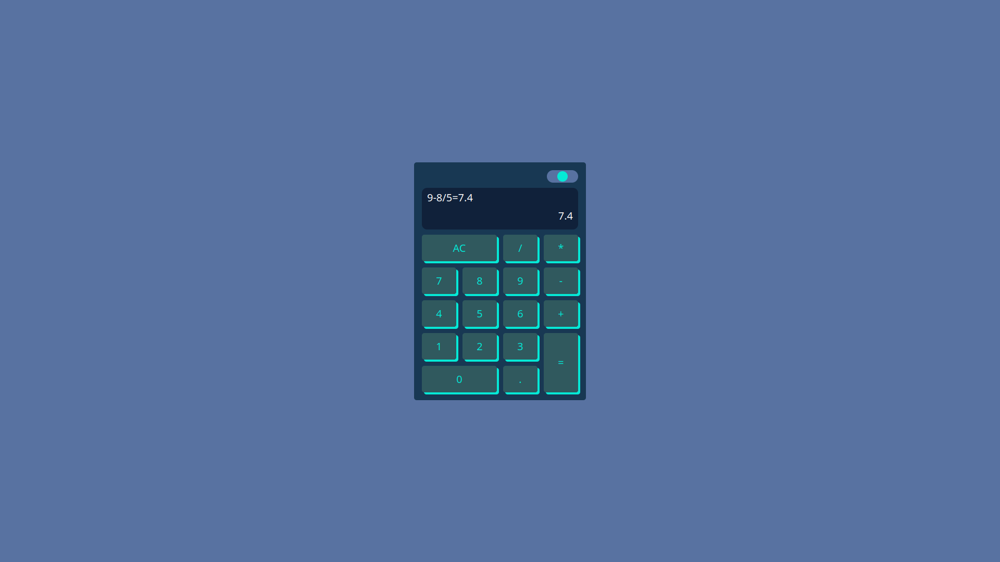

# React Calculator

This is a project for a simple calculator built using React.

## How to Install and Run

To run the application, follow these steps:

1. Clone the repository or download it as a ZIP file.
2. In a terminal, navigate to the folder where the application is located.
3. Run the `npm install` command to install all the necessary dependencies.
4. Run the `npm run dev` command to start the application in development mode.
5. Open your browser and navigate to `http://localhost:5173` to use the calculator.

## Features

The calculator has the following features:

- Allows basic operations such as addition, subtraction, multiplication, and division.
- Handles input errors.
- The user interface is intuitive and easy to use.

## Technologies Used

The calculator was built using the following tools and technologies:

- React

## Contribution

If you'd like to contribute to this project, feel free to submit a pull request. Before doing so, be sure to create a separate branch for your changes.

## Screenshots

